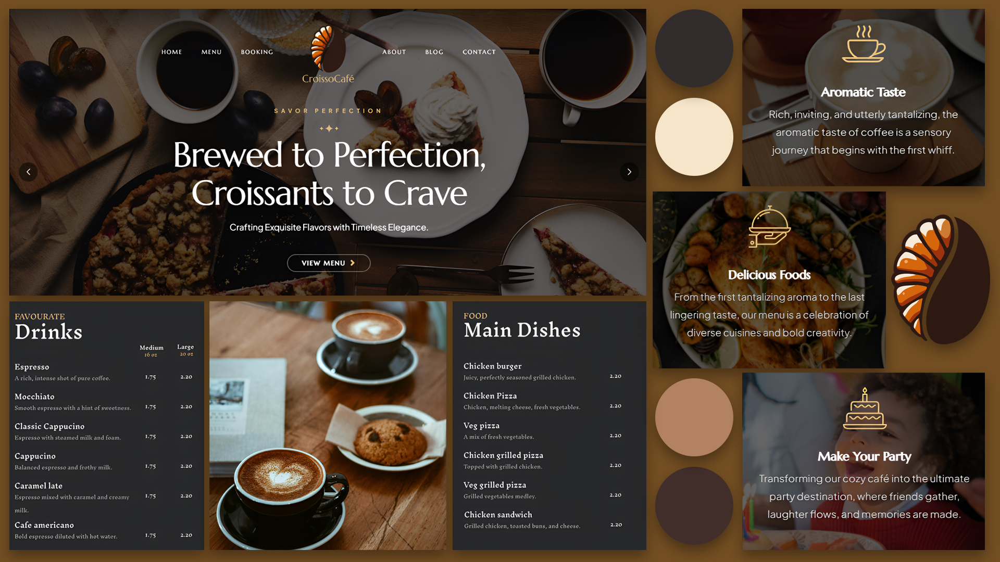

<h1 align="center">CroissoCafe – Brand & Portfolio Landing Page</h1>

<p align="center">
  
</p>

<h2 align="center">A modern portfolio café site designed from scratch</h2>

<p align="center">
  CroissoCafe is a self-initiated branding project focused on crafting a modern, elegant café identity.  
  The project involved end-to-end design — from brainstorming and moodboarding in Milanote, to logo sketching, mockups, and building a responsive landing page UI using HTML5, CSS3, and JS.  
  It's a demonstration of my design sensibility, frontend development, and creative direction.
</p>

---

## ✨ Features & Highlights

- 🍞 **Custom Branding**  
  Designed logo, color palette, and visual identity from scratch.
  
- 🖥️ **Responsive UI**  
  Fully responsive layout optimized for mobile, tablet, and desktop devices.

- 🧩 **Interactive Layout**  
  Scroll animations, image mockups, hero sections, contact forms, and gallery views.

- 🖌️ **Creative Design Process**  
  Brainstormed using Milanote, created moodboards, and used Illustrator + Photoshop for branding elements.

- 🛠️ **Frontend Stack**  
  Built using vanilla **HTML**, **CSS**, and **JavaScript** with clean, modular structure.

---

## 📸 Screenshots

<p align="center">
  
  
</p>
<p align="center">
  
  
</p>

---

## 🛠️ Tech Stack

- **HTML5 & CSS3**  
- **Vanilla JavaScript**  
- **Adobe Illustrator & Photoshop** (for logo and assets)  
- **Milanote** for ideation and moodboarding  
- **Canva** for quick visual presentation  
- **VS Code** as primary editor  

---

## 🚀 Getting Started

### 📁 Clone Repository

```bash
git clone https://github.com/your-username/CroissoCafe.git
cd CroissoCafe
```


🧠 Project Structure
```bash
CroissoCafe/
├── assets/                # Images, icons, fonts
├── css/                   # Stylesheets
├── js/                    # Scripts
├── index.html             # Landing Page
└── README.md              # Project ReadMe
```

<h2>🧑‍💻 Author</h2> <p><strong>Abu Huraira Jamal</strong><br> Frontend & MERN Developer<br> <a href="https://github.com/abuhuraira-73" target="_blank">GitHub Profile</a></p>

<h3>📬 Connect With Me</h3> <a href="https://github.com/abuhuraira-73" target="_blank">  </a> <a href="https://x.com/Abuhuraira0703" target="_blank">  </a> <a href="https://www.linkedin.com/in/abuhurairajamal/" target="_blank">  </a>
🙏 Acknowledgments
Thanks to the creative community on Milanote & Behance for design inspiration.

Self-initiated and designed by Abu Huraira Jamal.


